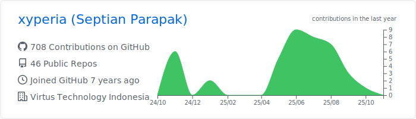
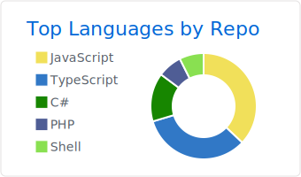
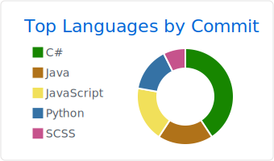
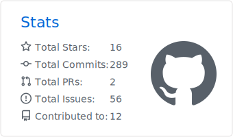

  ### Hi there, I'm [XYPERIA](https://xyperia.github.io) 👋

  - 🏢 I’m currently working as a SysDev at the IT Distributor company
  - 🎮 Add my [Steam](https://steamcommunity.com/id/xyperia) and let's play a game sometime or add me on [Discord](https://discordapp.com/users/357108041755262989) maybe 🤔
  - 🤙 How to reach me: [LinkedIn](https://www.linkedin.com/in/iyantp/), [Facebook](https://www.facebook.com/septian.trii/), and [Instagram](https://www.instagram.com/iyan.tp/)

  What I'm learning right now:

    

  

  
  
  

*Btw, I'm currently switching from cracked software (Don't tell anyone 🤫🤐) to FOSS 😎*

