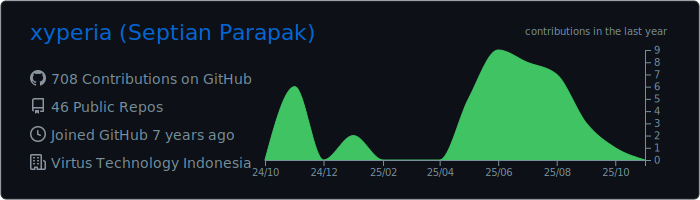
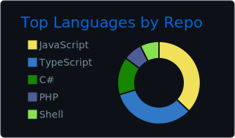
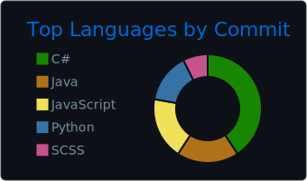

  
Hi there! 👋 I'm <strong>Yan</strong>, Male, 23 y.o

  
I’m currently working as a SysDev at the IT Distributor company

  
I have experience in 2D game and software development as a programmer

  
Feel free to add my <a href="https://steamcommunity.com/id/xyperia" target="_blank"> Steam </a> and let's play a game or two sometime or add me on <a href="https://discordapp.com/users/357108041755262989" target="_blank"> Discord </a>

 

  <strong> I'm learning </strong>   
  
  
  
  
  

  

  

  
  
  

  <i>Btw, I'm currently switching from cracked software (Don't tell anyone 🤫🤐) to FOSS 😬<i>

